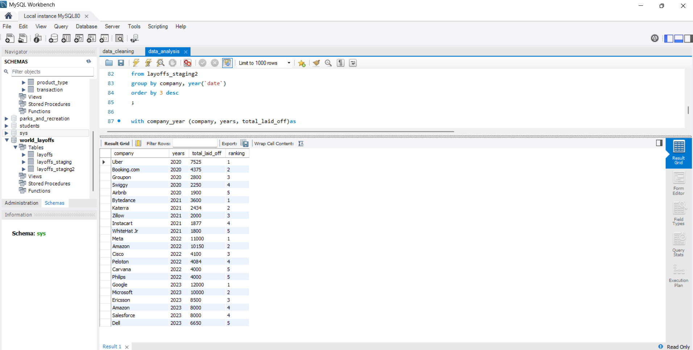

# SQL Data Cleaning and Analysis (MySQL)

## 📊 Project Overview
This project demonstrates SQL‑based data cleaning and analysis using MySQL Workbench.  
The dataset contains global company layoffs information, and the goal was to clean, standardize, and analyze trends.

## 🧹 Data Cleaning Steps
1. Created a staging table (`layoffs_staging`)
2. Removed duplicates
3. Standardized column formats
4. Handled NULL and blank values
5. Prepared clean dataset for analysis

## 📈 Data Analysis
- Aggregated layoffs by company and year  
- Ranked top 5 companies per year using `DENSE_RANK()`  
- Visualized results in MySQL Workbench result grid

## 🛠️ Tools Used
- MySQL Workbench  
- SQL (CTE, Window Functions, Aggregations)

## 📊 Main Findings and Insights

After cleaning and analyzing the global layoffs dataset, 
I identified the top 5 companies per year with the highest number of layoffs using SQL aggregation and window functions.

| Year | Top Companies (by layoffs) | Total Laid Off (approx.) |
|------|-----------------------------|---------------------------|
| 2020 | Uber, Booking.com, Groupon, Swiggy, Airbnb | 7,525 – 250 |
| 2021 | Bytedance, Katerra, Zillow, Instacart, WhiteHat Jr | 3,641 – 1,800 |
| 2022 | Meta, Amazon, Cisco, Peloton, Carvana | 11,253 – 2,000 |
| 2023 | Google, Microsoft, Ericsson, Philips, Dell | 20,000 – 6,650 |
| 2024 | Salesforce | 4,000 |

### 💡 Key Insights
- **Uber** had the highest layoffs in 2020.  
- **Bytedance** and **Katerra** led in 2021.  
- **Meta** and **Amazon** dominated 2022 layoffs.  
- **Google** and **Microsoft** topped 2023.  
- **Salesforce** appeared in 2024 as the major layoff contributor.  

This analysis demonstrates the use of `CTE`, `GROUP BY`, and `DENSE_RANK()` to extract business insights from structured data.

